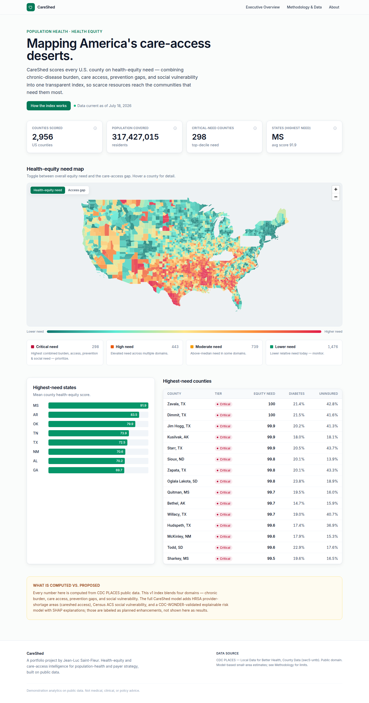

# CareShed

**Mapping America's care-access deserts and scoring the equity gap, county by county.**

CareShed scores every U.S. county on health-equity need — combining chronic-disease burden, care access,
prevention gaps, and social vulnerability into one transparent, reproducible index built on CDC public data.

It is project 2 of a five-product data portfolio by **Jean-Luc Saint-Fleur**.



## Why it exists

Chronic-disease burden and the supply of care are spatially mismatched. Population-health strategists,
payers, and public-health agencies need one defensible view — how sick a community is, how hard care is to
reach, and how much social disadvantage compounds both — to target scarce resources. CareShed is that view,
and it is honest about the limits of model-based estimates.

## What it does

- **Health-Equity Need Index** — a 0–100 score per county from four percentile-normalized domains combined
  with a weighted geometric mean.
- **Need tiers & archetypes** — Critical / High / Moderate / Lower tiers, plus a burden × access archetype.
- **Executive UI** — an interactive national county choropleth, KPI summary, highest-need states and counties,
  and a full methodology/limitations page.

## Tech stack

Next.js 15 (App Router) · TypeScript (strict) · Tailwind · MapLibre GL · Python/Pandas pipeline → validated
GeoJSON/JSON · Vitest · GitHub Actions · Vercel. Data is computed offline; the browser consumes clean artifacts.

## Data source (public, no key required)

CDC PLACES — Local Data for Better Health, County Data (`swc5-untb`, data.cdc.gov), public domain, plus public
U.S. Census county cartographic boundaries. See [`DATA_SOURCES.md`](DATA_SOURCES.md).

## Getting started

```bash
python3 scripts/build_index.py        # pull CDC PLACES + compute index -> data/processed/*
python3 scripts/validate/validate_outputs.py
npm install && npm run dev            # http://localhost:3000
```

## Quality gates

`npm run typecheck` · `npm run lint` · `npm test` · `python3 scripts/validate/validate_outputs.py` · `npm run build`.
CI runs all of them on every push/PR.

## Honesty

PLACES values are **model-based small-area estimates**, not direct counts. Domain weights are a documented v1
baseline. Provider-shortage (HRSA), ACS social vulnerability, and a CDC-WONDER-validated explainable model are
labeled as **proposed** enhancements, not shown as results. No number is hand-edited. License: MIT (code);
data public domain, attributed in `DATA_SOURCES.md`.
